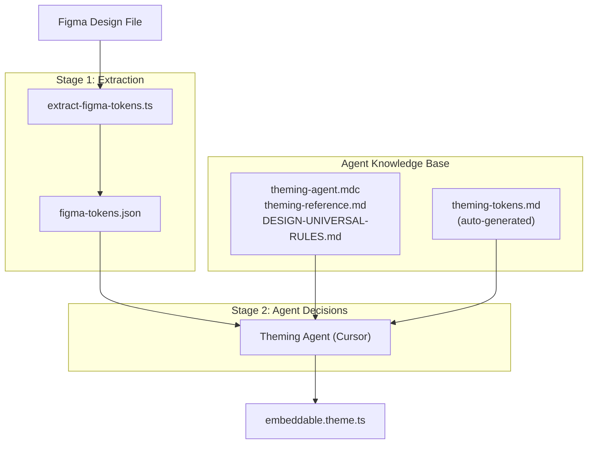
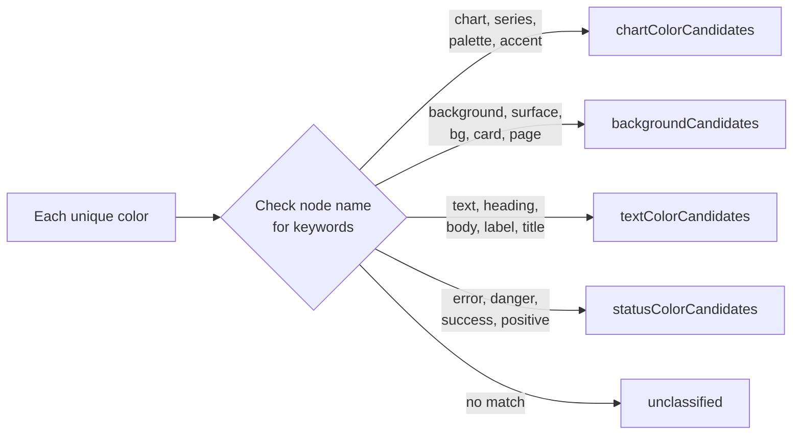
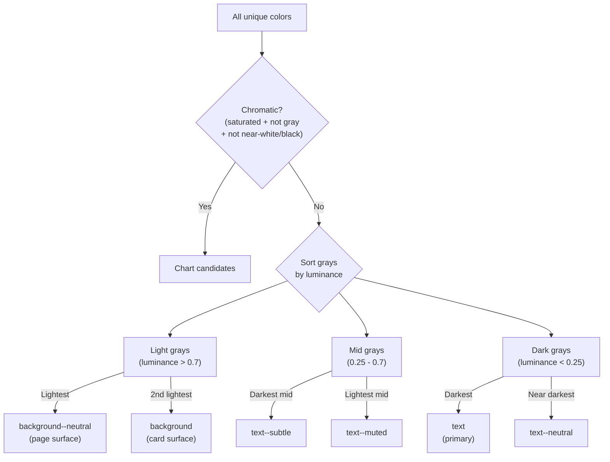
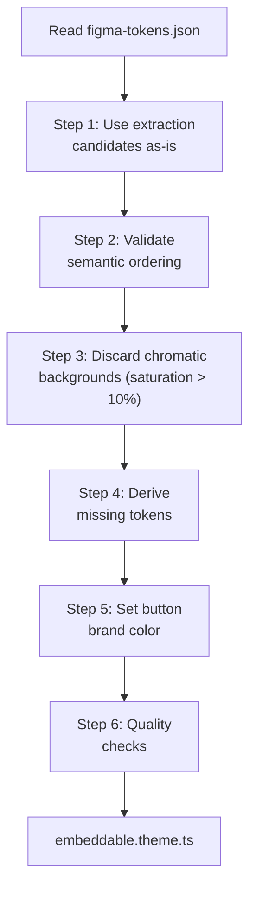
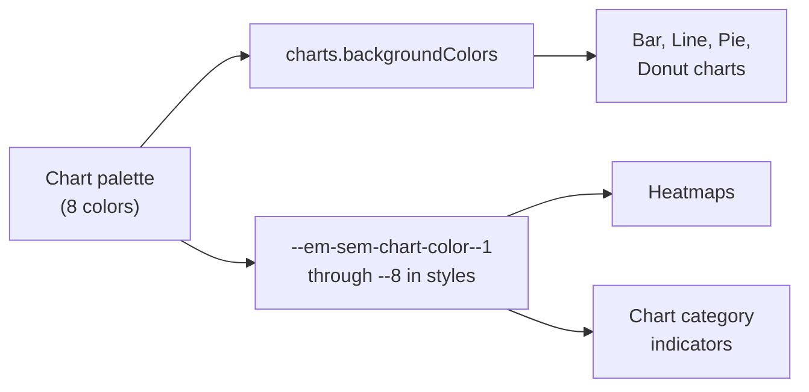

# How the Theming Agent Decides Which Colors to Use

This document explains the complete pipeline from a Figma design file to a finished `embeddable.theme.ts` theme — specifically, **how each color decision is made** at every stage.

---

## Pipeline Overview



The pipeline has two main stages:

1. **Extraction** — a deterministic script that reads the Figma API and classifies colors into candidate buckets
2. **Agent decisions** — the AI agent reads the candidates + rules and generates the final theme

---

## Stage 1: Extraction (`scripts/extract-figma-tokens.ts`)

The extraction script fetches the Figma file via API, traverses every node in the document, and collects all colors, text styles, and effects. It then classifies colors into candidate buckets using a **three-pass system**.

### Data collected per color

For every solid fill and stroke in the document, the script records:

| Field | Example | Purpose |
|-------|---------|---------|
| `hex` | `#6931ef` | The color value |
| `name` | `Link` | Figma node name (used for name-based classification) |
| `nodePath` | `Document > Page 1 > Header > Nav > Link` | Full path in the Figma tree |
| `source` | `node-fill` / `node-stroke` / `style` | Where it came from |
| `count` | 12 | How many nodes use this color |
| `totalArea` | 48000 | Sum of bounding box areas of nodes using this color |

### Pass 1: Name-based classification

The script examines each color's node name and path for semantic keywords:



**Background sub-classification** (based on additional keywords):

| Keywords | Assigned token |
|----------|---------------|
| `inverted`, `dark`, `tooltip` | `--em-sem-background--inverted` |
| `light`, `secondary` | `--em-sem-background--light` |
| `neutral`, `container`, `page` | `--em-sem-background--neutral` |
| `subtle`, `hover` | `--em-sem-background--subtle` |
| `muted`, `pressed` | `--em-sem-background--muted` |
| (generic background keyword) | `--em-sem-background` |

**Text sub-classification** (based on additional keywords):

| Keywords | Assigned token |
|----------|---------------|
| `inverted`, `white`, `on-dark` | `--em-sem-text--inverted` |
| `muted`, `secondary`, `subtitle` | `--em-sem-text--muted` |
| `subtle`, `disabled`, `placeholder` | `--em-sem-text--subtle` |
| (generic text keyword) | `--em-sem-text` |

### Pass 2: Luminance-based fallback

If Pass 1 found fewer than 3 matches total, the script falls back to purely visual classification based on color properties:



**Key thresholds:**

| Check | Threshold | Definition |
|-------|-----------|------------|
| Near-white | luminance > 0.85 | Excluded from chart candidates |
| Near-black | luminance < 0.05 | Excluded from chart candidates |
| Grayish | HSL saturation < 15% | Treated as gray, not chromatic |
| Chromatic | Not grayish + not near-white + not near-black | Potential chart color |
| Tinted gray | saturation 10-30%, luminance 0.05-0.85 | Treated as gray (e.g., blue-gray text) |

### Pass 3: TEXT node analysis

The script specifically examines colors used on TEXT-type Figma nodes (not rectangles, not frames — only actual text layers). This is the most reliable signal for text colors because it eliminates background fills.

**Flat design detection:** If >80% of all text nodes use the same color, the script recognizes a "flat design" and derives the full text hierarchy from that single color:

```
text           = the flat color (used as-is)
text--neutral  = mix(cardBg, flatColor, 0.90)   — 90% toward text
text--subtle   = mix(cardBg, flatColor, 0.55)   — 55% toward text
text--muted    = mix(cardBg, flatColor, 0.30)   — 30% toward text
```

**Multi-color text:** When multiple text colors exist, they are sorted by luminance:
- Dark text fills (luminance < 0.25) → primary text, ordered by frequency
- Mid text fills (0.25 - 0.7) → subtle and muted, ordered by luminance

### Chart color filtering and sorting

After classification, chart candidates go through two additional steps:

1. **Filtering** — removes colors that are:
   - Already classified as backgrounds
   - Near-white or near-black
   - Low saturation (< 20%)
   - Near-duplicate hues (within 15 degrees, keeping the most saturated variant)

2. **Sorting by prominence** — colors are ranked by: `firstSeen order` (primary), then `frequency x area` (tiebreaker). This means the first chart-like color the script encounters in the document tree ranks highest.

### Output: `figma-tokens.json`

The script produces a JSON file with these candidate buckets:

```json
{
  "chartColorCandidates": ["#6931ef", "#a984ff"],
  "backgroundCandidates": {
    "--em-sem-background": "#fafafa",
    "--em-sem-background--neutral": "#ffffff",
    "--em-sem-background--inverted": "#212129"
  },
  "textColorCandidates": {
    "--em-sem-text": "#212129",
    "--em-sem-text--neutral": "#37373e",
    "--em-sem-text--subtle": "#6b7280"
  },
  "statusColorCandidates": {},
  "effects": [
    { "name": "Card Shadow", "type": "DROP_SHADOW", "blur": 20, "..." : "..." }
  ]
}
```

---

## Stage 2: Agent Decisions

The AI agent reads `figma-tokens.json` along with three rule files and makes the final color assignments. The decision process follows a strict priority order.

### Decision priority



### Step 1: Use extraction candidates as-is

The extraction saw the actual Figma file — its values take precedence over any computed derivation.

| Extraction field | Maps to | Notes |
|-----------------|---------|-------|
| `chartColorCandidates` | `charts.backgroundColors` AND `--em-sem-chart-color--1` through `--N` | Both must be set (see "Dual chart color paths" below) |
| `backgroundCandidates` | `--em-sem-background`, `--neutral`, `--inverted`, etc. | Direct 1:1 mapping |
| `textColorCandidates` | `--em-sem-text`, `--neutral`, `--subtle`, `--muted` | Direct 1:1 mapping |
| `statusColorCandidates` | `--em-sem-status-error-text`, `--em-sem-status-success-text`, etc. | Direct 1:1 mapping |
| `effects` | `--em-core-shadow-*` tokens | Uses deterministic shadow selection (see below) |

### Step 2: Validate semantic ordering

The agent checks that extraction values respect the token hierarchy:

**Text (must go darkest to lightest):**
```
text > text--neutral > text--subtle > text--muted
```

**Backgrounds (must go lightest to darkest):**
```
background--neutral > background > background--light > background--subtle > background--muted
```

If an extraction value clearly violates ordering (e.g., a lighter color classified as `text` than `text--neutral`), the agent discards it and re-derives.

### Step 3: Discard chromatic backgrounds

Any `backgroundCandidate` with HSL saturation > 10% is treated as a misclassified brand color and replaced with a neutral derived value. This prevents the most common defect: brand-tinted tables, dropdowns, and cards.

**Example:** If extraction says `--em-sem-background` = `#ede8fc` (purple-tinted), the agent discards it and uses `#fafafa` instead.

### Step 4: Derive missing tokens

After steps 1-3, some of the 15 semantic color tokens may still be unset. The agent fills gaps using interpolation formulas:

**Text derivation** (anchors: primary text color + card background):
```
text--neutral  = mix(cardBg, textColor, 0.90)   — 90% toward text
text--subtle   = mix(cardBg, textColor, 0.55)   — 55% toward text
text--muted    = mix(cardBg, textColor, 0.30)   — 30% toward text
text--inverted = #FFFFFF
```

**Background derivation** (anchors: card background + primary text):
```
stepColor = mix(cardBg, textColor, 0.08)         — a hint of darkness

background--light  = mix(cardBg, stepColor, 0.40) — ~3-5% darker
background--subtle = mix(cardBg, stepColor, 1.0)  — ~8% darker
background--muted  = mix(subtle, textColor, 0.08)  — ~15% darker
background--inverted = #000000                      — or darkest design element
```

**Status color derivation** (when no status candidates exist):
- Error text: `#D92D20` (warm palette) or `#DC2626` (cool palette)
- Success text: Greenest chart color, or `#16A34A` if no green exists
- Status backgrounds: Status text at 8% opacity over card background

**Chart palette expansion** (when fewer than 6 chart colors):
- Rotate hue in even steps from existing colors
- Maintain similar saturation and lightness
- Ensure 30 degree minimum hue separation
- Target 8 colors total
- `borderColors[i]` = `backgroundColors[i]` darkened by 15%

### Step 5: Set button brand color

The default Remarkable UI maps button backgrounds to gray text tokens, not brand colors. The agent must explicitly override:

| Token | Value | How selected |
|-------|-------|-------------|
| `--em-button-background--primary` | Brand primary color | Most prominent saturated chart color, or a `Primary/*` named color from extraction |
| `--em-button-background--primary--hover` | Primary darkened ~15% | Computed from primary |
| `--em-button-background--primary--active` | Primary darkened ~25% | Computed from primary |
| `--em-button-color--primary` | `#FFFFFF` or `#000000` | White if brand is dark enough, black if brand is very light (e.g., yellow) |

### Step 6: Deterministic shadow selection

When multiple shadows exist in the extraction, the agent picks one deterministically:

1. Prefer shadows whose node name contains `card`, `bg`, `panel`, or `container`
2. Among name matches, prefer blur in the 20-60px range
3. If no name match, pick the shadow with smallest blur >= 10px
4. If no shadow >= 10px, pick the largest blur

### Dual chart color paths (critical)

`charts.backgroundColors` and `--em-sem-chart-color--N` are **two independent code paths** in remarkable-pro:



There is **no automatic sync**. The agent must always set both, with matching values.

---

## Stage 3: Quality Checks

Before outputting the final theme, the agent performs these validations:

### Neutral surface audit

| Token | Requirement |
|-------|-------------|
| `background--neutral` | Must be `#FFFFFF` or near-white (luminance > 0.95) |
| `background` (card) | Must be white or very light gray (luminance > 0.93) |
| `background--light` | Must be achromatic (HSL saturation < 5%) |
| `background--subtle` | Saturation up to ~15% acceptable |
| `background--muted` | Saturation up to ~15% acceptable |
| `background--inverted` | Exempt (dark surface) |

### WCAG AA contrast check

| Text token | Background token | Min ratio |
|-----------|-----------------|-----------|
| `text` | `background` | 4.5:1 |
| `text--muted` | `background--light` | 4.5:1 |
| `text--inverted` | `background--inverted` | 4.5:1 |
| `text--subtle` | `background` | 3:1 |

### Brand tinting guard

Brand/accent colors must never bleed into neutral surfaces (tables, dropdowns, cards, modals). Only `background--subtle` and `background--muted` may carry a faint brand tint.

---

## Token Map: What Controls What

```
┌─────────────────────────────────────────────────────────────┐
│  Page Container           background--neutral (#FFFFFF)      │
│  ┌───────────────────────────────────────────────────────┐  │
│  │  Card / Widget         background (#FAFAFA)            │  │
│  │                                                        │  │
│  │  Title text            text (#212129)                   │  │
│  │  Subtitle              text--neutral (#37373e)          │  │
│  │  Description           text--muted (#b9b9bb)            │  │
│  │                                                        │  │
│  │  ┌──────────────────────────────────────────────────┐  │  │
│  │  │  Input field        background--light (#f3f3f3)  │  │  │
│  │  │  Placeholder text   text--subtle (#6b7280)       │  │  │
│  │  └──────────────────────────────────────────────────┘  │  │
│  │                                                        │  │
│  │  ┌──────────────────────────────────────────────────┐  │  │
│  │  │  Bar Chart          charts.backgroundColors[0-N] │  │  │
│  │  │  Pie Chart          charts.backgroundColors[0-N] │  │  │
│  │  │  Heatmap            --em-sem-chart-color--1       │  │  │
│  │  └──────────────────────────────────────────────────┘  │  │
│  │                                                        │  │
│  │  ┌──────────────────────────────────────────────────┐  │  │
│  │  │  Hover state        background--subtle (#e9e9e9) │  │  │
│  │  │  Active/pressed     background--muted (#d9d9da)  │  │  │
│  │  └──────────────────────────────────────────────────┘  │  │
│  │                                                        │  │
│  │  [Primary Button]      button-background--primary      │  │
│  │   Button text          button-color--primary (#fff)    │  │
│  │                                                        │  │
│  │  ┌──────────────────────────────────────────────────┐  │  │
│  │  │  Tooltip (dark)     background--inverted (#000)  │  │  │
│  │  │  Tooltip text       text--inverted (#fff)        │  │  │
│  │  └──────────────────────────────────────────────────┘  │  │
│  │                                                        │  │
│  │  KPI positive trend    status-success-text             │  │
│  │  KPI negative trend    status-error-text               │  │
│  │  Trend backgrounds     status-*-background             │  │
│  │                                                        │  │
│  └───────────────────────────────────────────────────────┘  │
└─────────────────────────────────────────────────────────────┘
```

---

## Summary: 15 Semantic Color Tokens

| Token | Role | Source priority |
|-------|------|---------------|
| `--em-sem-background--neutral` | Page / outermost container | Extraction > derive (purest white) |
| `--em-sem-background` | Card / widget surface | Extraction > derive (off-white) |
| `--em-sem-background--light` | Secondary surfaces, inputs | Extraction > derive (~3-5% darker) |
| `--em-sem-background--subtle` | Hover / soft emphasis | Extraction > derive (~8% darker) |
| `--em-sem-background--muted` | Pressed / low-emphasis | Extraction > derive (~15% darker) |
| `--em-sem-background--inverted` | Dark surfaces (tooltips) | Extraction > derive (#000000) |
| `--em-sem-text` | Primary text (darkest) | Extraction > derive (near-black) |
| `--em-sem-text--neutral` | Near-primary emphasis | Extraction > derive (90% toward text) |
| `--em-sem-text--subtle` | Mid-emphasis (placeholders) | Extraction > derive (55% toward text) |
| `--em-sem-text--muted` | Lowest emphasis (legends) | Extraction > derive (30% toward text) |
| `--em-sem-text--inverted` | Text on dark surfaces | Extraction > derive (#FFFFFF) |
| `--em-sem-status-error-text` | Error / negative KPI | Extraction > derive (#D92D20 or #DC2626) |
| `--em-sem-status-error-background` | Error surface tint | Extraction > derive (error at 8% on card) |
| `--em-sem-status-success-text` | Success / positive KPI | Extraction > derive (greenest chart color) |
| `--em-sem-status-success-background` | Success surface tint | Extraction > derive (success at 8% on card) |

**Decision rule:** For every token, the agent uses the extraction value first. Only if the extraction has no candidate for that token does the agent compute a derived value.

---

## Known Limitation: Remarkable Pro Component Instances in Figma

When the Figma file contains actual Remarkable Pro component instances (from the Figma component library), the extraction script picks up **default component colors** alongside the designer's intentional brand colors. The script cannot distinguish between:

- A designer's chosen blue chart color (`#2563EB`)
- The default orange chart indicator color (`#FF5400`) that ships with Remarkable Pro
- Default gray backgrounds and text colors from the component library

This happens because the script traverses every node equally — it has no awareness of which colors are Remarkable Pro defaults vs. designer overrides. The generic node names inside components (e.g., "Background", "Label", "Container") match the name-based classification keywords, polluting the candidate buckets.

**Impact:** The generated theme may use default component colors instead of (or in addition to) the designer's intended palette.

**Current mitigation:** The agent's quality checks (neutral surface audit, contrast checks) catch some misclassifications, but chart color contamination remains undetected.

---

## Source Files

| File | Role |
|------|------|
| `scripts/extract-figma-tokens.ts` | Extraction script (Stage 1) |
| `.cursor/rules/theming-agent.mdc` | Agent decision rules (Stage 2) |
| `.cursor/theming-reference.md` | Derivation formulas and design guidelines |
| `DESIGN-UNIVERSAL-RULES.md` | Designer-authored quality rules |
| `.cursor/theming-tokens.md` | Auto-generated token reference (all 612 tokens with defaults) |
| `embeddable.theme.ts` | Output theme file |
